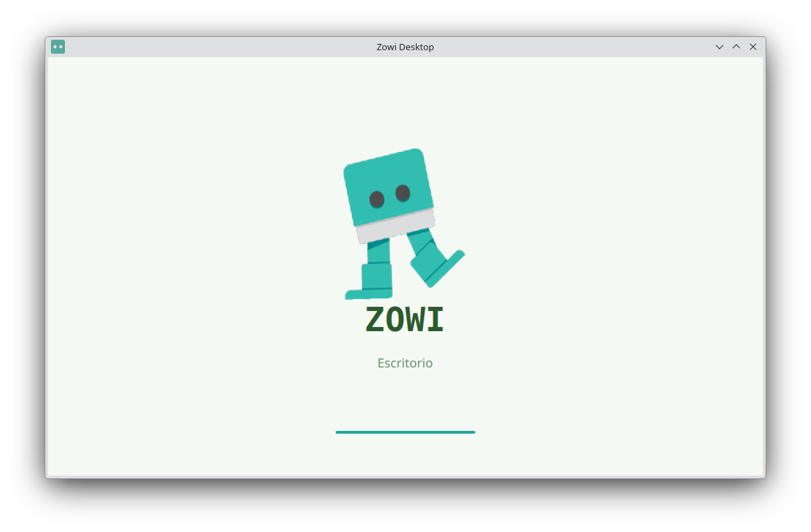
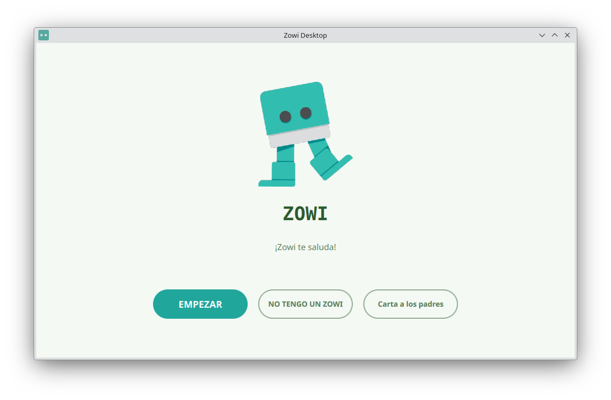

# Zowi Desktop

**Zowi Desktop** is a cross-platform application to control and program your Zowi robot from a computer.

Zowi is an open-source quadruped robot designed for education. It walks, dances, reacts to its environment, and helps children and beginners learn the basics of robotics and programming in a fun and hands-on way.

This desktop app lets you connect to Zowi via Bluetooth, control its movements, program its behaviour using visual blocks, and flash new firmware — all without needing an Android device or a mobile phone.

Whether you already own a Zowi or you are just curious about robotics, Zowi Desktop is your companion to explore, play, and learn.

---

Built with Qt and QML.
Open source — contributions welcome.
