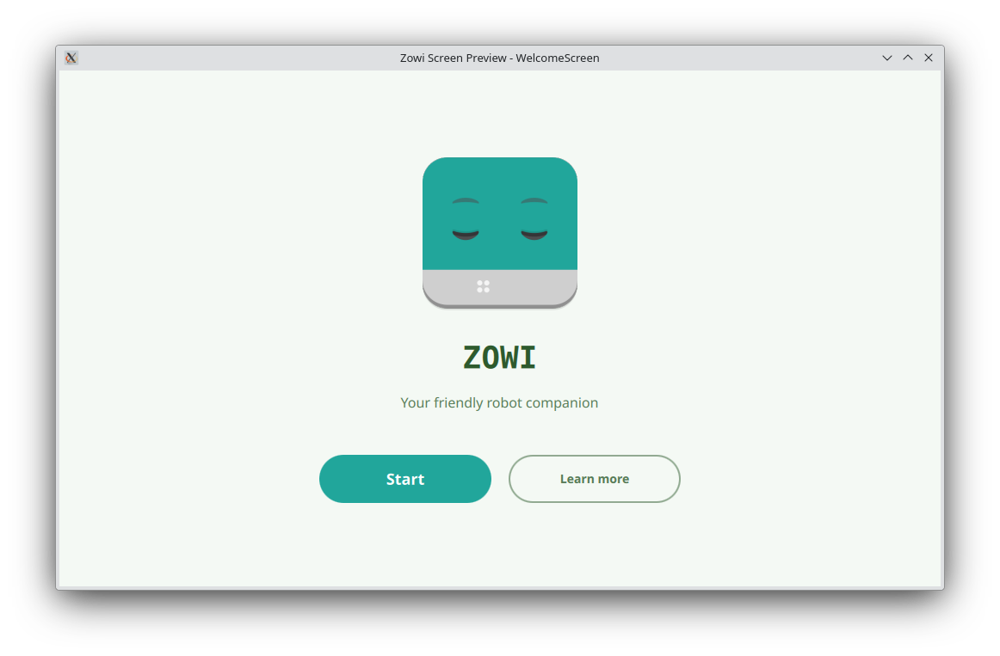

# Zowi Desktop

**Zowi Desktop** is a cross-platform application to control and program your Zowi robot from a computer.

Zowi is an open-source quadruped robot designed for education. It walks, dances, reacts to its environment, and helps children and beginners learn the basics of robotics and programming in a fun and hands-on way.


This desktop app lets you connect to Zowi via Bluetooth, control its movements, program its behaviour using visual blocks, and flash new firmware — all without needing an Android device or a mobile phone.

Whether you already own a Zowi or you are just curious about robotics, Zowi Desktop is your companion to explore, play, and learn.




---

Built with Qt and QML.
Open source — contributions welcome.

---

## Download & Install

### Option A — standalone download (AppImage / .deb)

Grab the latest `ZowiDesktop-*.AppImage` or `zowi-desktop_*.deb` from the
[Releases](https://github.com/eduardomillan/ZowiDesktop/releases) page.

- **AppImage**: `chmod +x ZowiDesktop-*.AppImage && ./ZowiDesktop-*.AppImage`
- **Debian / Lliurex / Ubuntu**: `sudo apt install ./zowi-desktop_*.deb`

### Option B — apt repository (recommended, auto-updates)

```bash
curl -fsSL https://eduardomillan.github.io/ZowiDesktop/keyring.gpg \
  -o /usr/share/keyrings/zowi-desktop-archive-keyring.gpg

# Pick the suite that matches your base:
#   Lliurex 23 / Ubuntu 22.04 -> jammy
#   Lliurex 25 / Ubuntu 24.04 -> noble
DISTRO=jammy   # change to "noble" on Lliurex 25

echo "deb [signed-by=/usr/share/keyrings/zowi-desktop-archive-keyring.gpg] \
  https://eduardomillan.github.io/ZowiDesktop $DISTRO main" \
  | sudo tee /etc/apt/sources.list.d/zowi-desktop.list
sudo apt update && sudo apt install zowi-desktop
```

Releases are built automatically from `v*` tags by GitHub Actions
(see `.github/workflows/release.yml`): each tag produces a GitHub Release
with the AppImage and the Debian package, and updates the signed apt
repository published on GitHub Pages.
